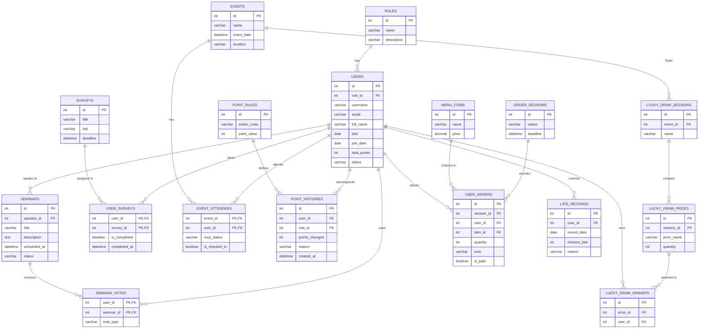

Dưới đây là thiết kế Database Schema (ERD) chi tiết cho hệ thống quản lý DU1. Thiết kế này được tối ưu hóa theo chuẩn chuẩn hóa dữ liệu (thường đạt 3NF) và phù hợp với các hệ quản trị cơ sở dữ liệu quan hệ như PostgreSQL hoặc MySQL.

### 1. Sơ đồ thực thể liên kết (ERD)

Bạn có thể sử dụng đoạn mã Mermaid dưới đây để render trực tiếp thành sơ đồ trên các trình duyệt hoặc IDE hỗ trợ:

---

### 2. Chi tiết các Table (Data Dictionary)

Dưới đây là đặc tả chi tiết cho các bảng quan trọng, tập trung vào kiểu dữ liệu và các ràng buộc (Constraints).

#### Nhóm Hệ thống & Người dùng
* **`roles`**
    * `id` (INT, PK, Auto Increment)
    * `name` (VARCHAR, Unique) - *VD: ADMIN, HR, MEMBER*
* **`users`**
    * `id` (INT, PK)
    * `role_id` (INT, FK)
    * `email` (VARCHAR, Unique, Indexed)
    * `join_date` (DATE) - *Dùng để trigger job chúc mừng Anniversary.*
    * `dob` (DATE) - *Dùng để trigger job chúc mừng sinh nhật.*
    * `total_points` (INT, Default 0) - *Cache tổng điểm hiện tại để query nhanh bảng xếp hạng thay vì sum từ bảng history.*
    * `status` (VARCHAR) - *ACTIVE, INACTIVE*

#### Nhóm Hoạt động (Seminar, Event, Survey)
* **`seminars`**
    * `id` (INT, PK)
    * `speaker_id` (INT, FK nullable)
    * `status` (VARCHAR) - *PROPOSED, APPROVED, SCHEDULED, DONE*
* **`seminar_votes`** (Bảng trung gian N-N)
    * `user_id` (INT, PK, FK)
    * `seminar_id` (INT, PK, FK)
    * `vote_type` (VARCHAR) - *UPVOTE, DOWNVOTE*
* **`user_surveys`** (Theo dõi ai đã làm khảo sát)
    * `user_id` (INT, PK, FK)
    * `survey_id` (INT, PK, FK)
    * `is_completed` (BOOLEAN, Default FALSE)
* **`event_attendees`**
    * `event_id` (INT, PK, FK)
    * `user_id` (INT, PK, FK)
    * `rsvp_status` (VARCHAR) - *YES, NO, MAYBE*
    * `is_checked_in` (BOOLEAN, Default FALSE) - *Phục vụ trigger cộng điểm tham gia.*

#### Nhóm Gamification (Điểm thưởng & Late Record)
* **`point_rules`** (Cấu hình rule linh hoạt)
    * `id` (INT, PK)
    * `action_code` (VARCHAR, Unique) - *VD: LATE_PENALTY, SEMINAR_SPEAKER, WIN_MINIGAME*
    * `point_value` (INT) - *Có thể âm hoặc dương (-5, +50).*
* **`point_histories`** (Audit log để trace mọi biến động điểm)
    * `id` (INT, PK)
    * `user_id` (INT, FK, Indexed)
    * `rule_id` (INT, FK nullable) - *Nullable nếu cộng điểm manual.*
    * `points_changed` (INT)
    * `reason` (VARCHAR) - *Mô tả chi tiết lý do.*
    * `created_at` (DATETIME)
* **`late_records`**
    * `id` (INT, PK)
    * `user_id` (INT, FK)
    * `record_date` (DATE)
    * `minutes_late` (INT)

#### Nhóm Tiện ích (Order Nước, Lucky Draw)
* **`order_sessions`**
    * `id` (INT, PK)
    * `status` (VARCHAR) - *OPEN, CLOSED, COMPLETED*
* **`user_orders`**
    * `id` (INT, PK)
    * `session_id` (INT, FK)
    * `user_id` (INT, FK)
    * `item_id` (INT, FK)
    * `note` (VARCHAR) - *VD: "Ít đường, nhiều đá"*
    * `is_paid` (BOOLEAN, Default FALSE) - *Tracking ai đã bank tiền.*
* **`lucky_draw_winners`**
    * `id` (INT, PK)
    * `prize_id` (INT, FK)
    * `user_id` (INT, FK)

---

### Ghi chú Tối ưu hóa (Database Optimization)
1.  **Index:** Nên đánh index cho các foreign keys và các column thường xuyên dùng trong điều kiện `WHERE` như `users.email`, `users.status`, `order_sessions.status`, và `user_surveys.is_completed`.
2.  **Toàn vẹn dữ liệu:** Sử dụng Transaction (với `@Transactional` nếu dùng Spring Boot) cho các thao tác liên quan đến **Gamification**. Ví dụ: Khi insert vào `late_records`, hệ thống phải đồng thời insert vào `point_histories` và update cột `total_points` trong bảng `users`. Nếu một trong ba bước lỗi, phải rollback toàn bộ để tránh sai lệch điểm số.

